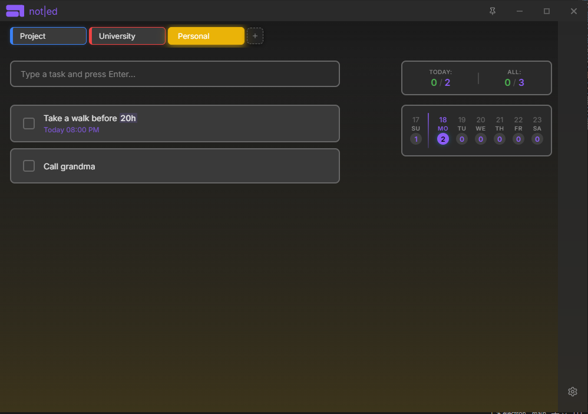
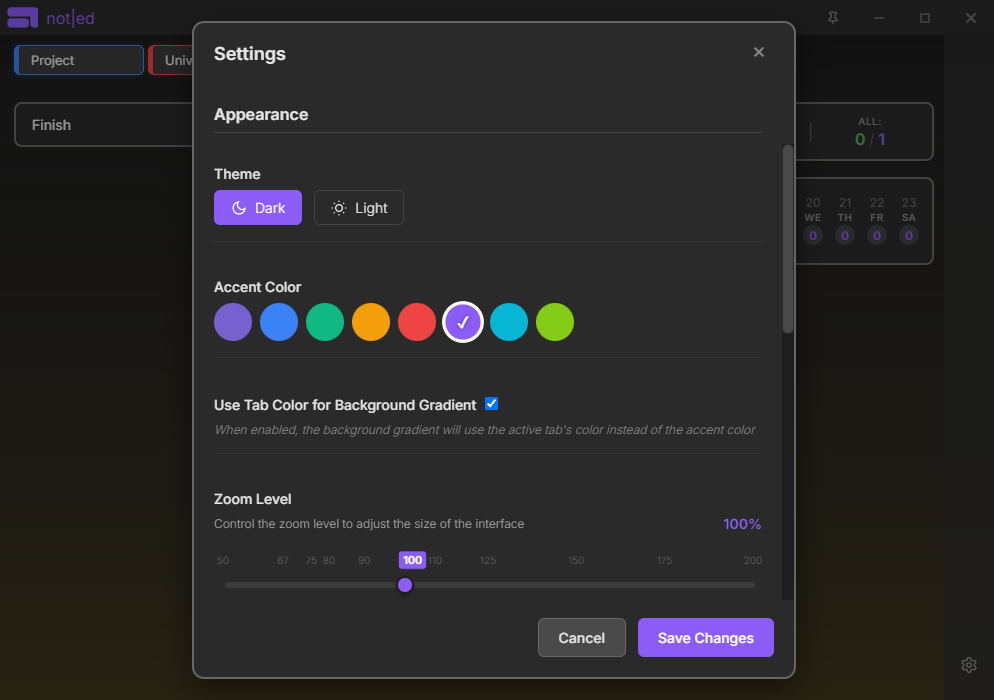

# Not|ed - Task Management App

<div align="center">
  
  <p><em>A modern, efficient task management application built with Electron</em></p>
</div>

---

## 📸 Screenshots

<div align="center">
  
### Main Interface


### Settings Panel


</div>

---

## Features

- **Task Management**: Create, edit, and organize tasks with ease
- **Repeat Tasks**: Set tasks to repeat daily, weekly, monthly, or yearly
- **Tab System**: Organize tasks into custom tabs with color coding
- **Dark/Light Themes**: Switch between dark and light modes
- **Responsive Design**: Animated panels and smooth transitions
- **Auto-Updates**: Automatic updates via GitHub Releases
- **Cross-Platform**: Available for Windows, macOS, and Linux

## Installation

### Download

Download the latest version from the [Releases page](https://github.com/martimaur/not-ed/releases).

### Platform-specific Instructions

- **Windows**: Download the `.exe` installer or portable version
- **macOS**: Download the `.dmg` file
- **Linux**: Download the `.AppImage` file

## Auto-Updates

The app automatically checks for updates when launched and will notify you when a new version is available. Updates are downloaded in the background and you'll be prompted to restart when ready.

## Development

### Prerequisites

- Node.js 18+ 
- npm or yarn

### Setup

```bash
git clone https://github.com/martimaur/not-ed.git
cd not-ed/main
npm install
npm start
```

### Building

```bash
npm run build
```

## Contributing

1. Fork the repository
2. Create a feature branch
3. Make your changes
4. Test thoroughly
5. Submit a pull request

## License

This project is licensed under the MIT License - see the [LICENSE](LICENSE) file for details.

## Changelog

### v1.0.0 (2025-08-18)
- Initial release
- Task management with repeat functionality
- Tab system with color customization
- Auto-updater integration
- Cross-platform builds
- Dark/light theme support
