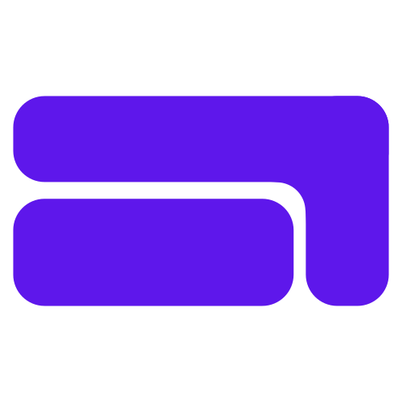
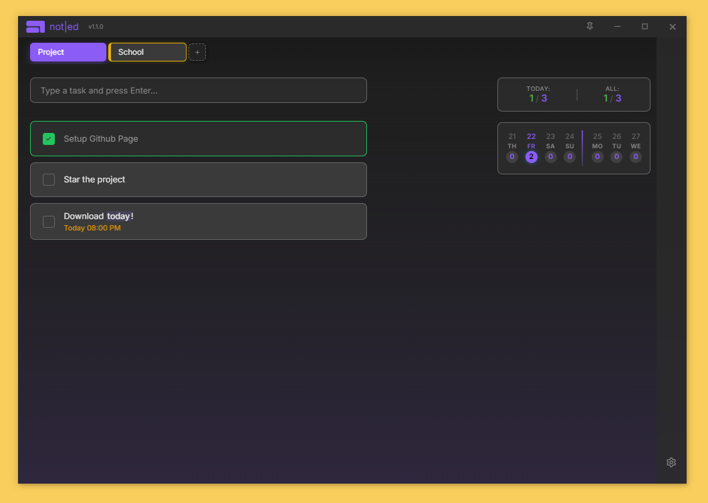

# Not|ed - Task Management App

<div align="center">
  
  <p><em>A modern, efficient task management application built with Electron</em></p>
  
  [](https://github.com/martimaur/not-ed/releases/latest)
  [](https://github.com/martimaur/not-ed/releases)
  
</div>

---

<div align="center">
  
</div>

## Features

- **Task Management**: Create, edit, and organize tasks with ease
- **Text to Date**: You can write "today" or "at 8pm" on a task and it will automatically set the date
- **Repeat Tasks**: Set tasks to repeat daily, weekly, monthly, or yearly
- **Tab System**: Organize tasks into custom tabs with color coding
- **Pin window**: Pin your window so you can focus on other stuff but keep your progress visible

## Installation

<div align="center">

## Installation

<div align="center">

### 📥 **Download Latest Version**

[](https://github.com/martimaur/not-ed/releases/download/v1.1.0/not-ed-1.1.0-windows.exe)
[](https://github.com/martimaur/not-ed/releases/download/v1.1.0/not-ed-1.1.0.dmg)
[](https://github.com/martimaur/not-ed/releases/download/v1.1.0/not-ed-1.1.0.AppImage)

<p><em>💡 Click to instantly download • Auto-updates included • Links update automatically with each release</em></p>

</div>

### Quick Install Guide

1. **Click your platform badge above** to instantly download the latest version
2. **Windows**: Run the downloaded `.exe` file to install
3. **macOS**: Open the downloaded `.dmg` file and drag to Applications
4. **Linux**: Make the downloaded `.AppImage` executable and run: `chmod +x not-ed-*.AppImage && ./not-ed-*.AppImage`

> **Note**: The app includes automatic updates, so you'll always stay current with the latest features and fixes!

## Auto-Updates

The app automatically checks for updates when launched and will notify you when a new version is available. Updates are downloaded in the background and you'll be prompted to restart when ready.

## Development

### Prerequisites

- Node.js 18+ 
- npm or yarn

### Setup

```bash
git clone https://github.com/martimaur/not-ed.git
cd not-ed/main
npm install
npm start
```

### Building

```bash
npm run build
```

## Contributing

1. Fork the repository
2. Create a feature branch
3. Make your changes
4. Test thoroughly
5. Submit a pull request

## License

This project is licensed under the MIT License - see the [LICENSE](LICENSE) file for details.

## Changelog

### v1.1.0 (2025-08-22) - First Stable Release
- ✅ **Fixed**: Light mode tab highlighting bug (colored tabs now show correct colors when active)
- ✅ **Improved**: Auto-updater stability and reliability
- ✅ **Added**: User data preservation across updates (tabs and tasks saved safely)
- ✅ **Enhanced**: Differential package updates for faster downloads
- ✅ **Optimized**: Professional Discord-style splash screen with progress tracking
